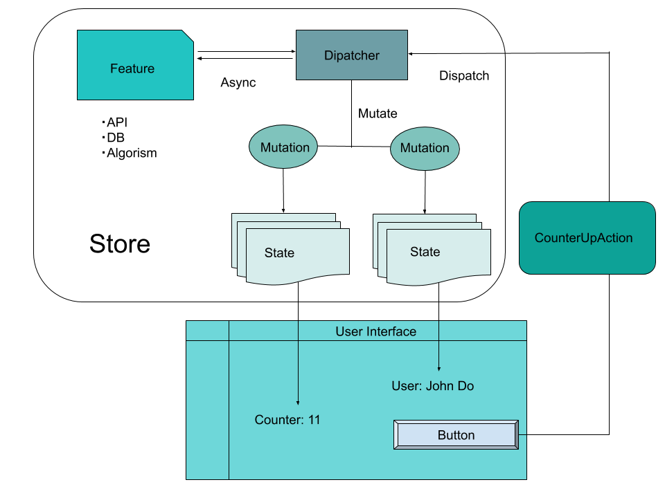

# Relux.js

[English](https://github.com/rempei-okada/relux.js/blob/main/relux/README.md) / 日本語

[](https://badge.fury.io/js/relux.js)
[](https://opensource.org/licenses/MIT)

ReactやJavaScriptで利用できる、シンプルで柔軟な状態管理ライブラリです。TypeScript Firstで設計しました。

Relux.jsを使用すると、めんどくさいボイラープレートに煩わされることなく、クラスベースのオブジェクト指向とDIを利用して単方向のデータフローを簡単に管理できます。

[DEMO](https://rempei-okada.github.io/relux.js/)

[NPM](https://www.npmjs.com/package/relux.js)

[Documents on Github](https://github.com/rempei-okada/relux.js)

# 開発の背景

既存のReactの状態管理ライブラリは合わないなと日々感じていました。

Redux、Recoil、MobXはReactの状態管理ライブラリとして人気があります。それ以外の場合でも、多数の状態管理ライブラリがあります。ミドルウェアも乱立していて、どちらを選ぶべきか迷います...

Reduxは、優れた関数型プログラミングで堅牢なデータフローを実現しました。Redux-Toolkitを使用することで、煩わしいボイラープレートを排除し、タイプセーフを維持できます。 しかし、Reduxは、ドメイン駆動設計、オニオンまたはクリーンアーキテクチャ、およびオブジェクト指向プログラミングで行われた依存性注入にはあまり適していないと思いました。そして、Recoilもそうです。

MobXはどうでしょう？MobXは、オブジェクト指向プログラミングアプローチを実現し、実装が簡単で、記述が非常に簡単です。ただし、必ずしも一方向のデータフローは必要ありません。つまり、ルールを設定しても簡単に破ることができます。

VueのVuexとElmのアーキテクチャは非常にシンプルで優れていると思います。これらの特性とタイプセーフを備えたオブジェクト指向プログラミングと簡単に統合できる状態管理ライブラリが必要でした。

したがって、VuexとElmのアーキテクチャを参考にして、ReduxとMobXの間のギャップを埋めるためにRelux.jsを考案します。

関数型プログラミングは素晴らしいですが、オブジェクト指向プログラミングと融合したい場合は、Relux.jsが役立つことでしょう。

# Rules


* 状態は常に読み取り専用にしましょう.
* 状態を変更するにはActionをDispatchしましょう.
* ディスパッチされたアクションを処理するすべてのミューテーションは、アクションに期待される変更と組み合わされた古い状態を反映する新しい状態を作成します.
* UIは新しい状態を使用して表示をレンダリングします。.

# Installation

```
yarn add relux.js react-relux
```

または

```
npm install --save relux.js react-relux
```

# Usage

例として、さまざまなパターンでカウンターとフィボナッチカウンターを実装します。
各機能はスライスできます。 複数のアクションと1つの状態の組み合わせは、スライスと呼ばれます。

すべての例はTypeScriptで記述されていますが、JavaScriptも使用できます。

## Create Initial State

まずは ```counter``` と ```Fib```の２つのスライスを作成しましょう.
Actionは自身のスライスの状態のみ更新できます.

### Define state type.

クラスのインスタンスとして定義する.

```ts
import { State } from "relux.js";

/**
 * State for counter.
 */
export class CounterState extends State<CounterState> {
    count = 0;

    get next() {
        return this.count + 1;
    }
}
```

プレーンオブジェクトとして定義する.

```ts
/**
 * State for fibonacci.
 */
export interface FibState {
    n: number;
    count: number;
}
```

## Create a store instance.

初期値やアクション、後述するServiceを登録してStoreインスタンスを作成しましょう. Serviceを登録するとDIすることができます.

```ts
import { createProvider } from "relux.js";

export const store = createProvider({
    slices: {
        counter: {
            name: "counter",
            actions: [
                AsyncIncrementCountAction
            ],
            // class instance
            state: new CounterState()
        },
        fib: {
            name: "fib",
            actions: [
                IncrementalFibonacciAction,
            ],
            // plane object
            state: {
                n: 0,
                count: 0
            }
        }
    },
    // Register services that resolves in actions
    services: [
        FibonacciService
    ]
});

// Export RootState Type
export type RootState = ReturnType<typeof store.getState>;
```

## Create Actions

アクションを作成するには```Action<TState,  Tpayload>``` クラスを継承する必要があります. クラス名がアクション名となります.  TStateには状態の型, TPayoadにはペイロードの型を指定してください。 
ActionをDispatchした際、invokeメソッドがコールされます.

クラス名がアクション名となりますが, Webpackや静的サイトジェネレータなどで圧縮されて元のクラス名がわからなくなる場合は, ```name``` プロパティを定義することでアクション名を上書きできます.

```ts
class HogeState extends State<HogeState> {
    hoge = 12345678;
}

interface HogePayload { hoge: number; }

class HogeAction extends Action<HogeState, HogePayload> {
    readonly name = "OverriddenHogeActionName";

    invoke(payload: HogePayload): Feature<HogeState> {
        return ({ mutate }) => {
            mutate(s => s.clone({ hoge: payload.hoge }));
        };
    }
}

store.dispatch(HogeAction, { hoge: 123456 });
```

### This is an example action for counter.

```ts
import { Action, Feature } from "relux.js";

/**
 * Increment counter with delay.
 */
export class AsyncIncrementCountAction extends Action<CounterState, number>  {
    public invoke(timeout: number): Feature<CounterState> {
        return async ({ mutate, state }) => {
            await new Promise(resolve => setTimeout(resolve, timeout));
            mutate(s => s.clone({
                count: s.count + 1
            }))
        };
    }
}
```

## Dispatch an action and change states

1000ms後にカウントアップします.

```ts
store.dispatch(AsyncIncrementCountAction, 1000);
```

## Subscribe on states changed

1000ms後にカウントアップした際に発火します.

```ts
store.subscribe(e => {
    console.log(`Counter: ${e.state.count}`);
    console.log(`Slice Name: ${e.sliceName}`);
});
```

## Dispatch another action in an action

```ts
import { Action, Feature } from "relux.js";

/**
 * Increment counter with delay.
 */
export class AsyncIncrementCountAction extends Action<CounterState, number>  {
    public invoke(timeout: number): Feature<CounterState> {
        return async ({ mutate, state }) => {
            await new Promise(resolve => setTimeout(resolve, timeout));
            mutate(s => s.clone({
                count: s.count + 1
            }));

            // Dispatch another slice action
            dispatch(AsyncIncrementCountAction, 1000);
        };
    }
}
```

## With React

Reactを使用した際の例です. Hooksを利用して、状態を更新、描画をしています.

```tsx
import { Provider, useDispatch, useObserver } from "react-relux";

export default () => {
    return (
        <Provider store={store}>
            <div style={{ padding: "20px" }}>
                <Counter />
                <FibCounter />
            </div>
        </Provider>
    );
};

function Counter() {
    const dispatch = useDispatch();
    const counter = useObserver((s: RootState) => s.counter);
    const next = useObserver((s: RootState) => s.counter.next);

    function increment() {
        dispatch(AsyncIncrementCountAction, 1000)
    }

    return (
        <div>
            <h1>Counter</h1>
            <button onClick={increment}>Count</button>
            <p>Counter will increment after 1000ms</p><br />
            <div>Count: {counter.count}</div>
            <div>Next: {next}</div>
            <br />
        </div>
    );
}

function FibCounter() {
    const dispatch = useDispatch();
    const counter = useObserver((s: RootState) => s.fib);

    function increment() {
        dispatch(IncrementalFibonacciAction, undefined)
    }

    return (
        <div>
            <h1>Fibonacci counter</h1>
            <button onClick={increment}>Compute</button>
            <p>Compute Fibonacci number when N {"<"} 40</p>
            <p>Counter will increment after 1000ms</p><br />
            <div>Fib: {counter.count}</div>
            <div>N: {counter.n}</div>
        </div>
    );
}
```

## Dependency Injection

HTTPリクエスト、非同期、DBアクセス、アルゴリズム実装などの副作用として実装されたServiceには、依存性の注入（DI）を使用してアクションからアクセスできます。

### Create a service and register

フィボナッチ数を生成するServiceを実装してみましょう.

```ts
class FibonacciService {
    public fib(n: number) {
        if (n < 3) return 1;
        return this.fib(n - 1) + this.fib(n - 2);
    }
}
```

You must register a Service to ```option.services``` when creating a store instance.

```ts
const store = createProvider({
 slices: { ... },
 services: [
     FibonacciService
 ]
});
```

### Resolve without Decorator

コンストラクタ引数を定義した配列を返す静的プロパティ `` `parameters```を定義すると、ActionをDispatchするときにServiceがコンストラクター引数に自動的に割り当てられます。 Serviceはネストすることもできます。
パラメーターは、コンストラクターの引数と正確に一致する必要があります。

```ts
/**
 * Increament fibonacci counter action.
 */
export class IncrementalFibonacciAction extends Action<FibState, undefined> {
    static parameters = [FibonacciService];

    // Assign a service automatically.
    constructor(private readonly fibService: FibonacciService) { 
        super();
    }

    public invoke(_: undefined): Feature<FibState> {
        return ({ dispatch, mutate, state }) => {
            if (state.n < 40 === false) {
                return;
            }

            const fib = this.fibService.fib(state.n + 1);

            // update state
            mutate(s => ({
                ...s,
                count: fib,
                n: s.n + 1
            }));

            // Dispatch another slice action
            dispatch(AsyncIncrementCountAction, 1000);
        };
    }
}
```

### Resolve with Decorator

#### Setup

デコレータを利用すると自動でDIを解決することができます。
TypeScriptの場合、tsconfig.json内で `` `experimentalDecorators```フラグと` `` emitDecoratorMetadata```フラグを有効にする必要があります。

Bable（Gatsby、Create React Appなどの場合）でコンパイルする場合は、次のBabelプラグインが必要です。

```
yarn add -D @babel/plugin-proposal-decorators babel-plugin-transform-typescript-metadata
```
または
```
npm install -D @babel/plugin-proposal-decorators babel-plugin-transform-typescript-metadata
```

Babelの設定ファイル ```.babelrc``` または ```babel.config.js``` の ```plugins``` 項目に以下を追加してください.

```
["@babel/plugin-proposal-decorators", { "legacy": true }],
["babel-plugin-transform-typescript-metadata"]
```

クラスに ```@Injectable``` デコレータを付与してください.
特に何もしなくとも、コンストラクタ引数の型を解析して自動でDIされるようになります.

```ts
import { Injectable } from "relux.js";

/**
 * Increament fibonacci counter action.
 */
@Injectable()
export class IncrementalFibonacciAction extends Action<FibState, undefined> {
    constructor(private readonly fibService: FibonacciService) { 
        super();
    }

    public invoke(_: undefined): Feature<FibState> {
        return ({ dispatch, mutate, state }) => {
            if (state.n < 40 === false) {
                return;
            }

            const fib = this.fibService.fib(state.n + 1);

            // update state
            mutate(s => ({
                ...s,
                count: fib,
                n: s.n + 1
            }));

            // Dispatch another slice action
            dispatch(AsyncIncrementCountAction, 1000);
        };
    }
}
```

# License
MIT Licenseです.
Renpei Okadaより♥を込めて設計しました. 

# Have a nice development life ♥